# Analysing_Citation_Networks
This involves exploring the High-energy physics citation network. Arxiv HEP-PH (high energy physics phenomenology) citation graph is from the e-print arXiv. If a paper i cites paper j, the graph contains directed edge from i to j. If a paper cites, or is cited by, a paper outside the dataset, the graph does not contain any information about this. 

# Report

#### Metrics used for  Analysis

``` Degree Distribution```

``` Centrality Measure ```

``` Clustering Coefficient```

``` Connected Components ```

``` Graph Diameter ```

``` Community Detection ```

``` Vizualisation ```


## TASK 1

### Major analysis is performed on dataset of 5000 points and 12000 points over the years`1900-2023` majorly.

### Metrics for 25,500 Datapoints:

1. **Number of Strongly Connected Components (SCCs):**
   - The network is divided into a substantial number of strongly connected components (11,861). This indicates that within each of these components, there is a path between every pair of nodes, but the components themselves may not be connected.

2. **Average Clustering Coefficient:**
   - The average clustering coefficient is relatively low (0.033). This suggests a lower tendency for nodes to form tightly knit clusters or communities. The network might be more decentralized, with connections spread out rather than forming local clusters.

3. **Number of Communities:**
   - The network is partitioned into a large number of communities (2,554). This indicates that there are distinct groups of nodes that are more densely connected within themselves than with the rest of the network. The research topics or themes might be diverse and segmented.

4. **Graph Connectivity:**
   - The graph is not strongly connected, confirming the presence of multiple strongly connected components.

5. **Number of Nodes and Edges:**
   - The network consists of 11,866 nodes and 18,784 edges.

### Metrics for 12,000 Datapoints:

1. **Number of Strongly Connected Components (SCCs):**
   - The network is divided into a fewer number of strongly connected components (5,489) compared to the larger dataset.

2. **Average Clustering Coefficient:**
   - The average clustering coefficient is higher (0.068) compared to the larger dataset. This suggests a higher tendency for nodes to form local clusters or communities.

3. **Number of Communities:**
   - The network has a lower number of communities (637) compared to the larger dataset. This might indicate a more cohesive structure with fewer distinct research themes.

4. **Graph Connectivity:**
   - Similar to the larger dataset, the graph is not strongly connected.

5. **Number of Nodes and Edges:**
   - The network consists of 5,493 nodes and 10,824 edges.

### Observations:

- The larger dataset exhibits a more decentralized and diverse structure with a higher number of strongly connected components and communities.
  
- The smaller dataset, while having fewer strongly connected components and communities, has a higher average clustering coefficient, indicating a relatively more clustered or cohesive structure.

- The differences in these metrics suggest variations in the structure and organization of the citation network based on the size of the dataset. Further analysis and domain-specific knowledge would be valuable to interpret these observations in the context of high-energy physics research.

`    Decrease in Clustering Coefficient:`

        The clustering coefficient measures the tendency of nodes to form clusters or groups in a network. A decrease in the clustering coefficient indicates a reduction in the local density of connections between neighboring nodes.

        This could imply that the citation network is becoming more decentralized or that the connections between papers are less likely to form closed triads (clusters of interconnected nodes). Papers might be citing a more diverse set of sources or there could be an increasing influence of external factors impacting the network structure.


`    Increase in the Number of Communities:`

        The number of communities in a network refers to the presence of distinct groups of nodes that are more densely connected internally than with the rest of the network. An increase in the number of communities suggests a higher level of modularity or compartmentalization within the citation network.

        This might indicate the emergence of more specialized or niche areas of research within high-energy physics. Papers within each community may share more common references and themes, contributing to the formation of distinct clusters.


DEGREE OF NODE i.e. PAPERS PER YEAR (12000 data points)

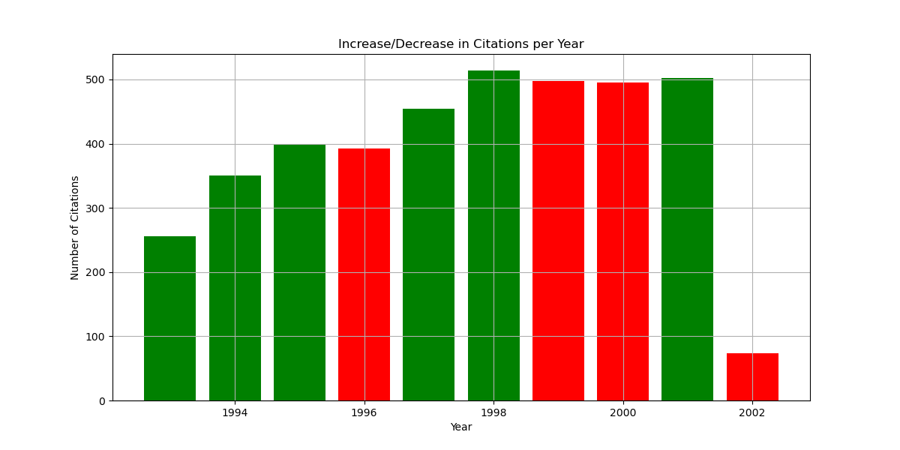

PAPERS PER YEAR (12000 data points)


    We can observe a sudden drop in the papers in 2002 which could be potentially because:
      - the dataset is biased since before the sudden drop the papers published were around average only.
      - Decrease in publications and citations over the years as we further see that papers of certain domain are only growing majorily. Therefore the sudden decrease in papers in 2002 could be due to lesser topics in the same domain to work upon.

<!--  EDGES i.e. CITATIONS PER YEAR -->

<!-- NETWORK (12000 data points) PER YEAR
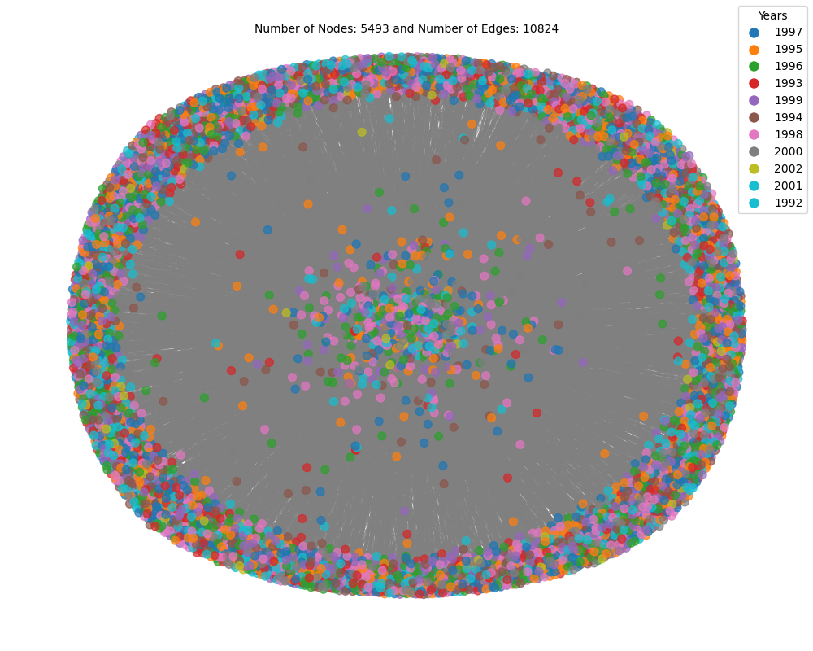

NETWORK (5000 data points) PER YEAR
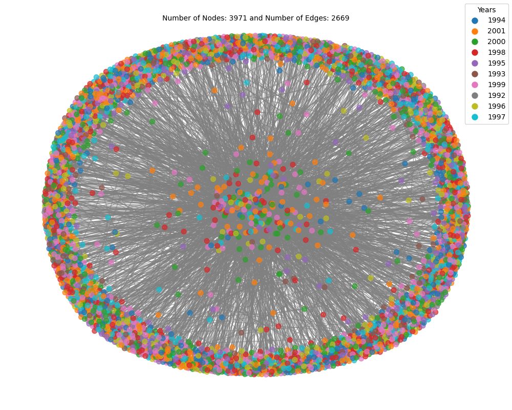

NETWORK (5000 data points)
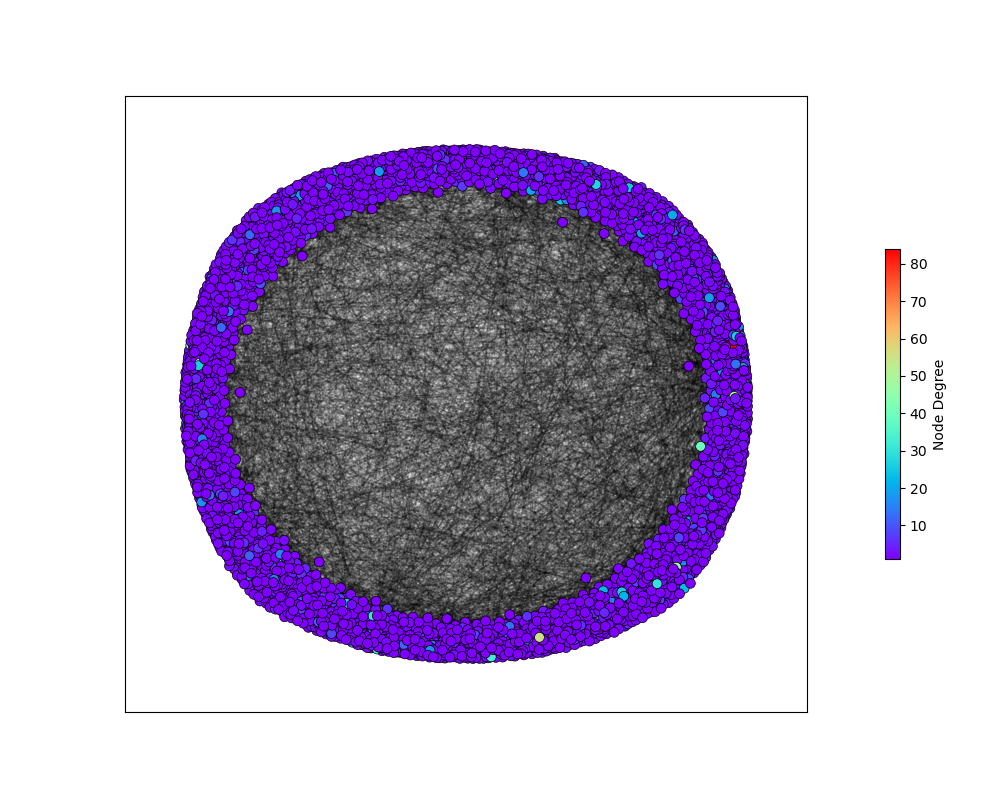 -->

## ALGORITHM TO FIND COMMUNITES

`Louvain Method:`

    Modularity-Based Approach: The Louvain method is a modularity-based algorithm. It aims to maximize the modularity of the network, which is a measure that evaluates the quality of a division of a network into communities.

    Greedy Optimization: The Louvain method employs a greedy optimization technique, where nodes are iteratively moved between communities to improve the modularity.

    Fast and Scalable: It is known for its speed and scalability, making it suitable for large-scale networks.

`Girvan-Newman Algorithm:`

    Edge Betweenness-Based Approach: The Girvan-Newman algorithm focuses on edge betweenness, which measures the number of shortest paths that pass through a particular edge. Edges with high betweenness are considered as bridges between communities.

    Hierarchical Clustering: It uses a hierarchical clustering approach, systematically removing edges with the highest betweenness until communities are revealed.

    Computationally Intensive: The Girvan-Newman algorithm can be computationally intensive, especially on large networks, due to the need to calculate betweenness for all edges.

`Comparison:`
Objective Function: Louvain optimizes modularity, while Girvan-Newman aims to identify edges with high betweenness. The objectives are different, and the algorithms have different ways of achieving their goals.

    Speed and Scalability: Louvain is often considered faster and more scalable, making it suitable for large networks. Girvan-Newman can be computationally expensive, particularly on larger graphs.

    Community Structure: The choice between the algorithms may depend on the nature of the community structure in the network. Some networks may have a modular structure that aligns well with modularity optimization (Louvain), while others may have communities separated by bridges (Girvan-Newman).

`Which is Better:`
The choice between Louvain and Girvan-Newman depends on the specific characteristics of the network and the goals of the analysis. There is no one-size-fits-all answer, and the suitability of each algorithm can vary based on factors such as network size, density, and the nature of community structures.

In general, Louvain is often preferred for its speed and efficiency, especially in large networks, but Girvan-Newman may be more suitable when analyzing networks with distinct bridge-like edges between communities.

##### OBSERVATION
    As we can observe in the below images that Louvain Algorithm gives us more dense communities whereas in girvan it is not the case.

### GIRVAN NEWMAN ALGORITGM

<!-- COMMUNITIES over 100 datapoints -->
<!-- 

COMMUNITIES over 200 datapoints
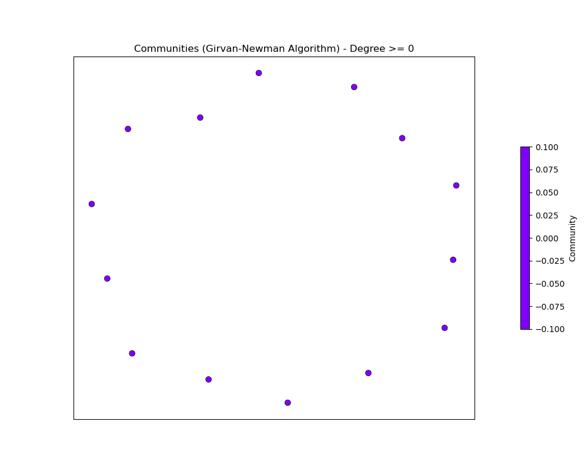

COMMUNITIES over 5000 datapoints
 -->

COMMUNITIES over 12000 datapoints

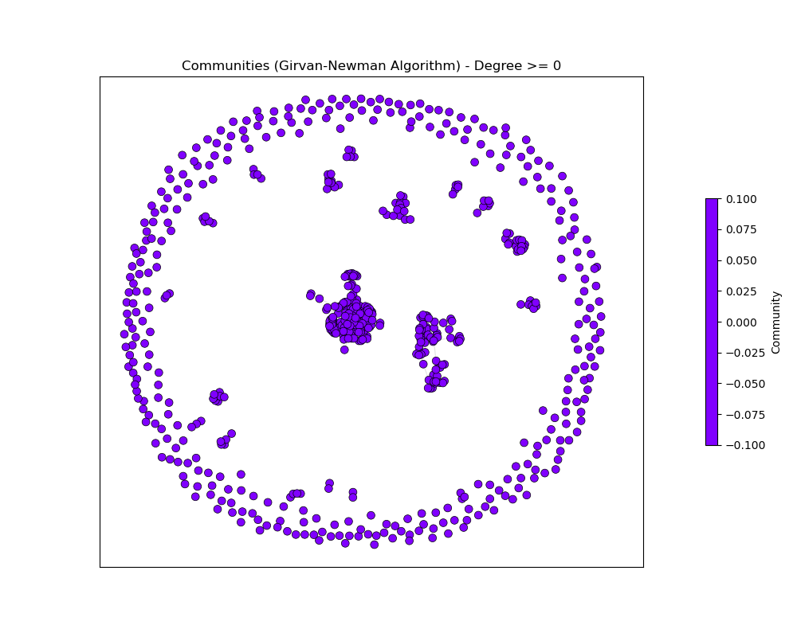
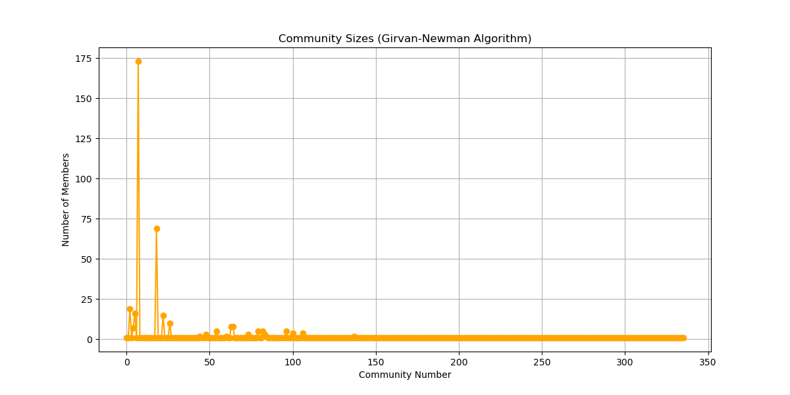

COMMUNITIES over 25500 datapoints

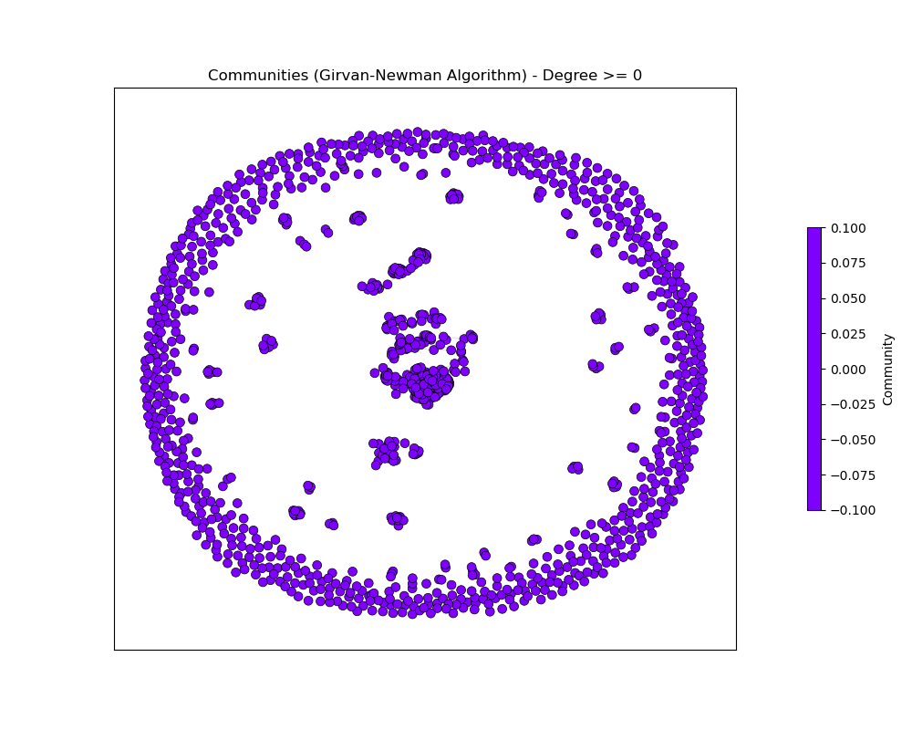


### LOUVAIN ALGORITHM

<!-- COMMUNITIES over 100 datapoints -->

<!-- 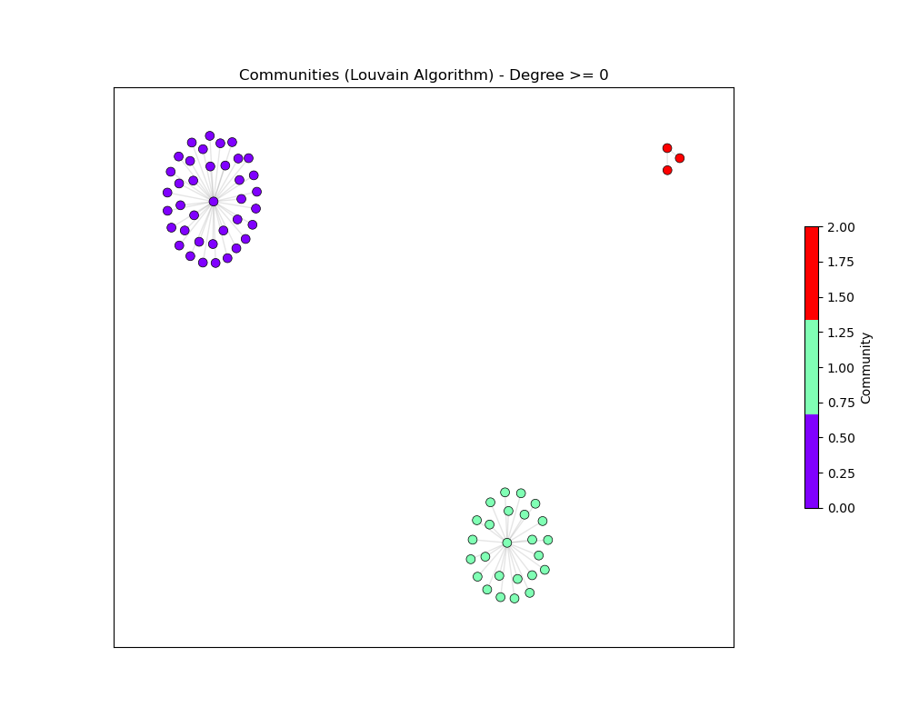

COMMUNITIES over 200 datapoints


COMMUNITIES over 5000 datapoints

 -->

COMMUNITIES over 12000 datapoints

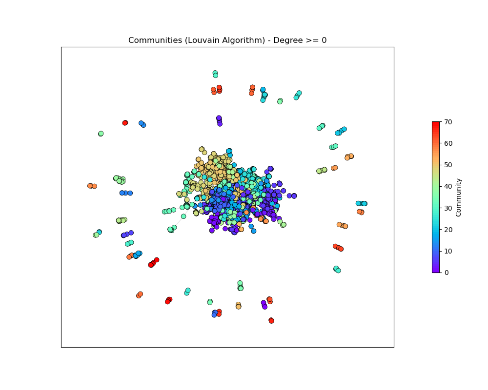


COMMUNITIES over 255000 datapoints


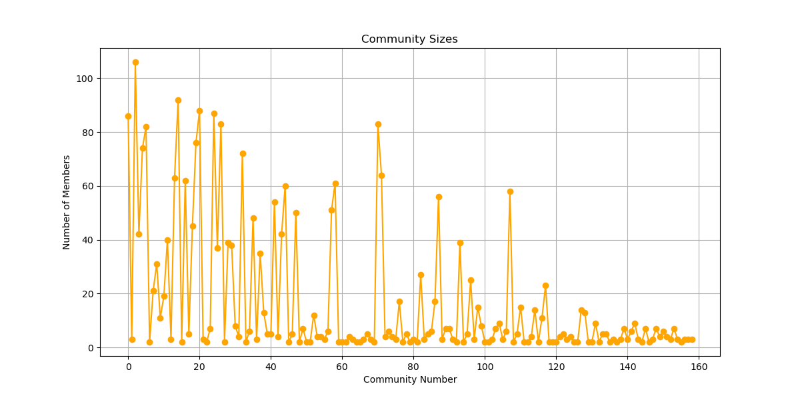

# Communities formed over years 1998-2001


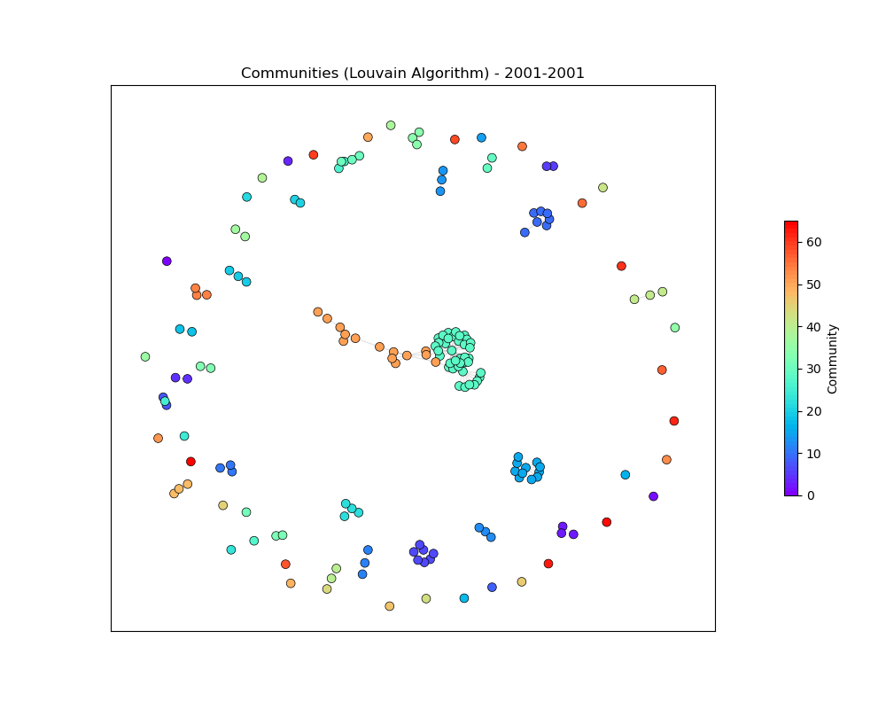

#### Observation: & Finding
    
##### (Temporal Community Detection)
    
    An additional observation based on the provided images is that larger communities appear to experience more significant growth compared to smaller ones over the years 1998-2001. The images suggest that the size disparity between large and small communities becomes more pronounced as time progresses.

    This observation may indicate a potential cumulative advantage or preferential attachment phenomenon, where well-established and larger communities attract more attention, collaboration, and citations. As these larger communities accumulate more contributors and citations, they might have a competitive edge over smaller communities, leading to their continued growth.

    The disparity in growth rates between large and small communities could be influenced by factors such as the visibility of prominent researchers, the appeal of well-established research topics, and the network effects that come with being part of a larger and more interconnected community.

    This dynamic pattern underscores the importance of understanding the mechanisms driving the growth of research communities and raises questions about how to ensure equitable opportunities for smaller communities to thrive and contribute meaningfully to the academic landscape.

    In summary, the observation suggests that, over the years 1998-2001, larger communities tend to experience more substantial growth compared to smaller ones, possibly reflecting a pattern of cumulative advantage in the academic and research domains.

### LINK PREDICTION
   As we can observe a growth of citations in similar domains. We can certainly predict the upcoming papers' domains which will further be useful to predict.


## References

    FOR PLOTTING:
    http://snap.stanford.edu/data/cit-HepPh.html  (citation network of physicists at hep-ph classification)
    https://networkx.org/documentation/stable/auto_examples/drawing/plot_directed.html 

    FOR ANALYSIS: 
    https://www.cs.rice.edu/~nakhleh/COMP571/Slides-Spring2015/GraphTheoreticProperties.pdf 
    https://www.analyticsvidhya.com/blog/2018/04/introduction-to-graph-theory-network-analysis-python-codes/


## Timeline


`Library Exploration`
    Explored the possibility of using the SNAP library for graph analysis but encountered version issues, leading to the decision to use NetworkX for building the graph.

`Graph Construction`
    Successfully constructed the citation network using NetworkX. Noted that the edge count is less than mentioned in the dataset documentation due to the representation of unordered pairs.

`Node Visualization`
    Implemented node visualization with different colors based on their degrees to visually inspect the density of the graph at nodes. This step provides an initial understanding of the distribution of citations.

`Matplotlib Performance Testing`
    Encountered performance challenges while plotting the entire graph using Matplotlib due to its large size. Conducted tests with a smaller dataset (from Datasets/cit-HepPh.txt/sample_5000.txt) successfully within a few seconds.

`Graph Plotting`
    Successfully plotted a subset of the graph containing 5000 points to provide a visual representation of the citation network. This step helps in gaining insights into the overall structure and connections within the high-energy physics community.

`Metric Analysis`

    Initiated the analysis of various metrics to understand the characteristics of the citation network. Metrics include degree distribution, centrality measures, clustering coefficient, connected components, graph diameter, community detection, and visualization techniques.

`Documentation and References`

    Referenced external sources such as Graph Theoretic Properties and Analytics Vidhya for guidance on graph analysis techniques.

`Larger dataset`
    Used a larger dataset of 12000 and 25500 points to get better analysis. The smaller dataset was used for testing purposes, but the larger one is needed for more accurate results.


