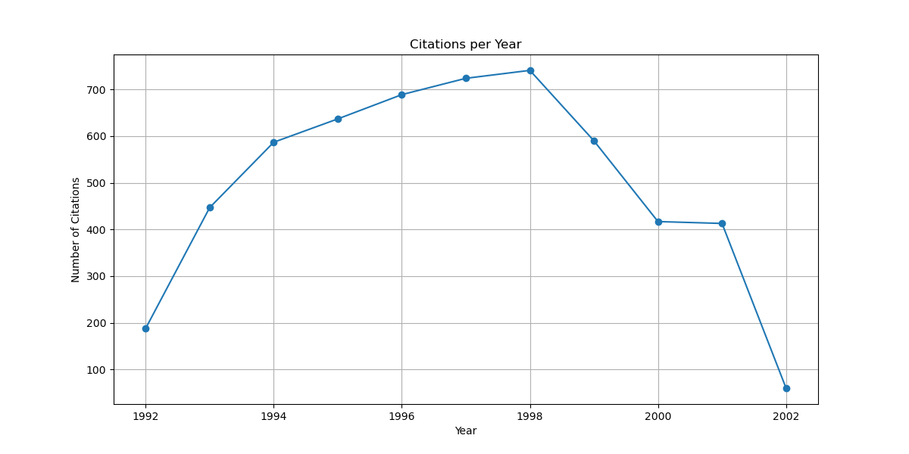

# Analysis Report

## TASK 1

    Major analysis is performed on dataset of 5000 points and 12000 points over the years`1900-2023` majorly.

Metrics calculated for 12000 datapoints:

    1. Number of Strongly Connected Components: 5489

    2. Average Clustering Coefficient: 0.06775297322004578

    3. Number of Communities: 637

    4. The graph is not strongly connected.

    5. no. of node: 4045

    6. no. of edges:2741

Metrics calculated for 25500 datapoints:

    1. Number of Strongly Connected Components: 

    2. Average Clustering Coefficient

    3. Number of Communities: 

    4. The graph is not strongly connected.

    5. no. of node: 

    6. no. of edges: 

DEGREE OF NODE i.e. PAPERS PER YEAR  (12000 data points)

PAPERS PER YEAR (12000 data points)

    We can observe a sudden drop in the papers in 2002 which could be potentially because the dataset is biased since before the sudden drop the papers published were around average only.
<!--  EDGES i.e. CITATIONS PER YEAR -->

<!-- NETWORK (12000 data points) PER YEAR

NETWORK (5000 data points) PER YEAR

NETWORK (5000 data points)
 -->

## ALGORITHM TO FIND COMMUNITES
`Louvain Method:`

    Modularity-Based Approach: The Louvain method is a modularity-based algorithm. It aims to maximize the modularity of the network, which is a measure that evaluates the quality of a division of a network into communities.

    Greedy Optimization: The Louvain method employs a greedy optimization technique, where nodes are iteratively moved between communities to improve the modularity.
    
    Fast and Scalable: It is known for its speed and scalability, making it suitable for large-scale networks.

`Girvan-Newman Algorithm:`

    Edge Betweenness-Based Approach: The Girvan-Newman algorithm focuses on edge betweenness, which measures the number of shortest paths that pass through a particular edge. Edges with high betweenness are considered as bridges between communities.

    Hierarchical Clustering: It uses a hierarchical clustering approach, systematically removing edges with the highest betweenness until communities are revealed.

    Computationally Intensive: The Girvan-Newman algorithm can be computationally intensive, especially on large networks, due to the need to calculate betweenness for all edges.

`Comparison:`
    Objective Function: Louvain optimizes modularity, while Girvan-Newman aims to identify edges with high betweenness. The objectives are different, and the algorithms have different ways of achieving their goals.

    Speed and Scalability: Louvain is often considered faster and more scalable, making it suitable for large networks. Girvan-Newman can be computationally expensive, particularly on larger graphs.

    Community Structure: The choice between the algorithms may depend on the nature of the community structure in the network. Some networks may have a modular structure that aligns well with modularity optimization (Louvain), while others may have communities separated by bridges (Girvan-Newman).

`Which is Better:`
The choice between Louvain and Girvan-Newman depends on the specific characteristics of the network and the goals of the analysis. There is no one-size-fits-all answer, and the suitability of each algorithm can vary based on factors such as network size, density, and the nature of community structures.

In general, Louvain is often preferred for its speed and efficiency, especially in large networks, but Girvan-Newman may be more suitable when analyzing networks with distinct bridge-like edges between communities.

    As we can observe in the below images that Louvain Algorithm gives us more dense communities whereas in girvan it is not the case.

### GIRVAN NEWMAN ALGORITGM

<!-- COMMUNITIES over 100 datapoints -->
<!-- 

COMMUNITIES over 200 datapoints

COMMUNITIES over 5000 datapoints
 -->

COMMUNITIES over 12000 datapoints

COMMUNITIES over 25500 datapoints

### LOUVAIN ALGORITHM

<!-- COMMUNITIES over 100 datapoints -->

<!-- 

COMMUNITIES over 200 datapoints

COMMUNITIES over 5000 datapoints

 -->

COMMUNITIES over 12000 datapoints

COMMUNITIES over 255000 datapoints

# Communities formed over years 1998-2001

    Observation: An additional observation based on the provided images is that larger communities appear to experience more significant growth compared to smaller ones over the years 1998-2001. The images suggest that the size disparity between large and small communities becomes more pronounced as time progresses.

    This observation may indicate a potential cumulative advantage or preferential attachment phenomenon, where well-established and larger communities attract more attention, collaboration, and citations. As these larger communities accumulate more contributors and citations, they might have a competitive edge over smaller communities, leading to their continued growth.

    The disparity in growth rates between large and small communities could be influenced by factors such as the visibility of prominent researchers, the appeal of well-established research topics, and the network effects that come with being part of a larger and more interconnected community.

    This dynamic pattern underscores the importance of understanding the mechanisms driving the growth of research communities and raises questions about how to ensure equitable opportunities for smaller communities to thrive and contribute meaningfully to the academic landscape.

    In summary, the observation suggests that, over the years 1998-2001, larger communities tend to experience more substantial growth compared to smaller ones, possibly reflecting a pattern of cumulative advantage in the academic and research domains.